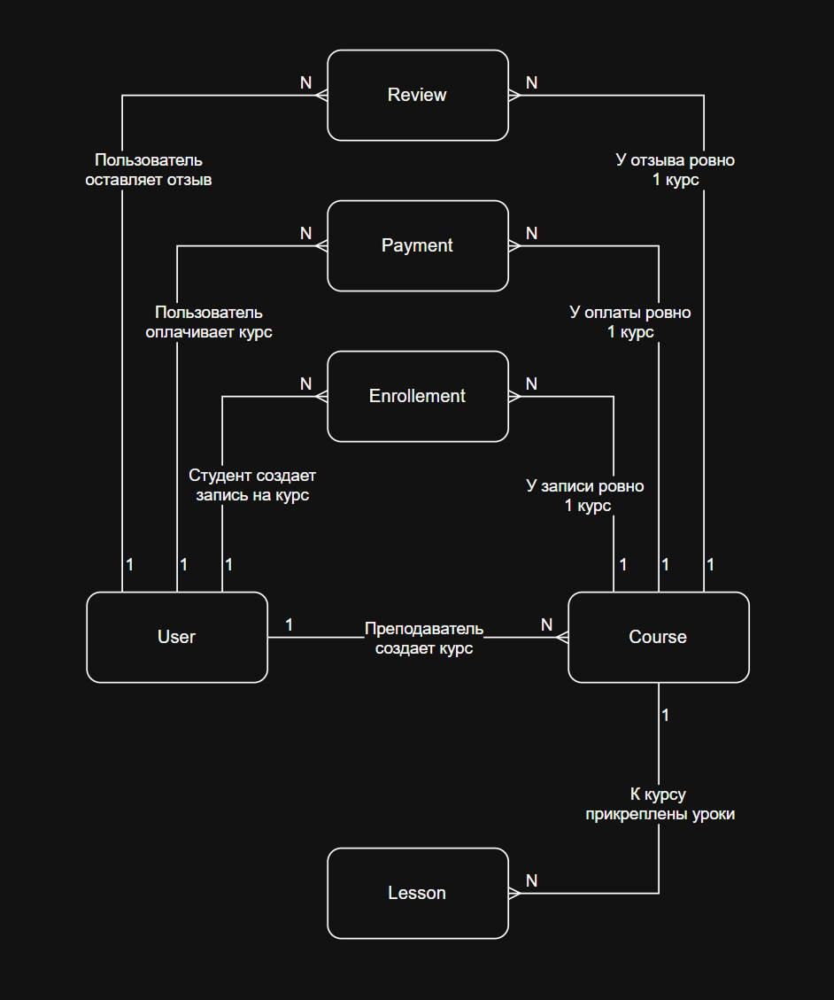
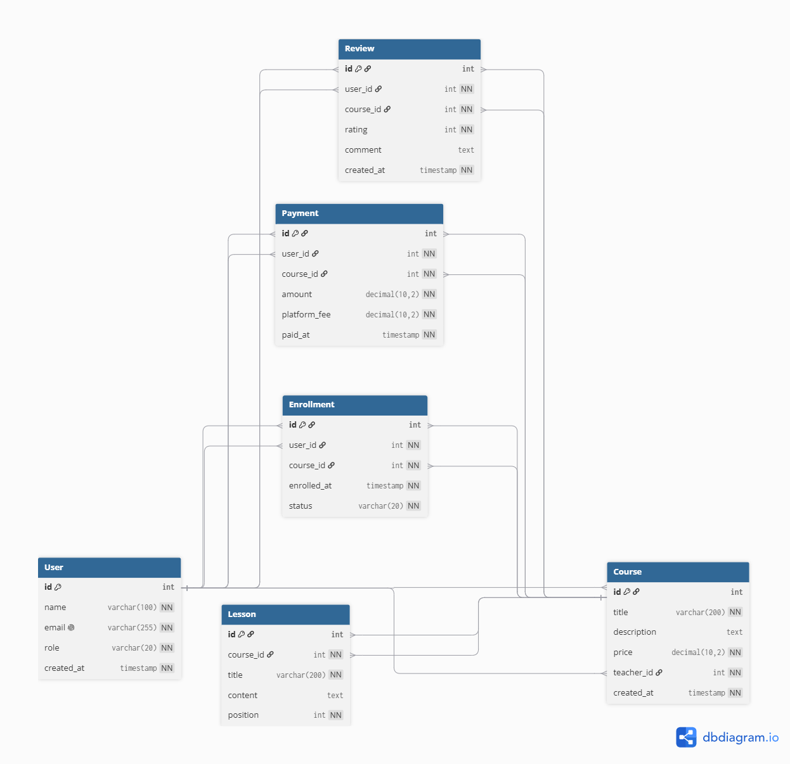

# ДЗ №1 Вар 1 Онлайн-курсы (EdTech)

Работа включает построение концептуальной, логической и физической моделей базы данных, выбор типов данных и ограничений целостности, а также реализацию модели в PostgreSQL. Для проверки работоспособности база данных была запущена в Docker, после чего выполнена проверка созданных таблиц и их связей.

## Соответствие бизнес-домена и модели

| **Бизнес-требование** | **Как реализовано** |
| --- | --- |
| «Платформа позволяет пользователям регистрироваться» | Сущность `User`, содержащая данные пользователя. |
| «Преподаватели могут создавать курсы» | Связь `User` 1:N `Course`. Один преподаватель может создать несколько курсов. Роль преподавателя хранится в сущности `User`. |
| «Пользователи могут выбирать курсы и проходить обучение» | Сущность `Enrollment`, связывающая `User` и `Course`. Отношение между пользователями и курсами является многие-ко-многим, поэтому используется промежуточная сущность. |
| «Каждый курс состоит из нескольких уроков» | Сущность `Lesson`, связанная с `Course` отношением 1:N. Один курс содержит несколько уроков. |
| «Студенты могут оставлять отзывы на курсы и оценивать их по шкале от 1 до 5» | Сущность `Review`, связанная с `User` и `Course`. Один пользователь может оставить отзывы на несколько курсов, а один курс может иметь отзывы от нескольких пользователей. |
| «Преподаватели получают отчисления от продаж» | Сущность `Payment`, связанная с `User` и `Course`. Она используется для отражения выплат преподавателю, связанных с продажами его курсов. |

## Концептуальная модель


### Сущности

**User** — пользователь платформы (студент, учитель)

**Course** — учебный курс вцелом

**Lesson** — урок внутри курса

**Enrollment** — факт записи пользователя на курс

**Payment** — факт оплаты курса пользователем и распределения суммы платежа между платформой и преподавателем. 

**Review** — отзыв пользователя о курсе с оценкой

### Почему такая реализация?

**Одна сущность `User`** используется для студентов и преподавателей, так как они имеют одинаковые основные данные. Роль пользователя определяется атрибутом, что позволяет не дублировать сущности

**Одна сущность `Payment`** используется для оплаты курса и выплаты преподавателю. Часть суммы удерживается платформой в качестве комиссии, а оставшаяся сумма считается выплатой преподавателю. Поэтому отдельная сущность `Payout` не требуется.

> Принимается бизнес-правило, согласно которому после оплаты курса пользователем полученная сумма сразу распределяется между платформой и преподавателем.

## Логическая модель



Диаграмма построена в [dbdiagram.io](https://dbdiagram.io/), в нотации Crow's Foot: одиночная черта обозначает сторону «один», раздвоенный символ — сторону «многие».

### Атрибуты и ключи

| **Сущность** | **Атрибуты** | **PK** | **FK** |
| ------------ | ------------ | ------ | ------ |
| `User`       | `id`, `name`, `email`, `role`, `created_at` | `id` | — |
| `Course`     | `id`, `title`, `description`, `price`, `teacher_id`, `created_at` | `id` | `teacher_id` → `User.id` |
| `Lesson`     | `id`, `course_id`, `title`, `content`, `position` | `id` | `course_id` → `Course.id` |
| `Enrollment` | `id`, `user_id`, `course_id`, `enrolled_at`, `status` | `id` | `user_id` → `User.id`, `course_id` → `Course.id` |
| `Review`     | `id`, `user_id`, `course_id`, `rating`, `comment`, `created_at` | `id` | `user_id` → `User.id`, `course_id` → `Course.id` |
| `Payment`    | `id`, `user_id`, `course_id`, `amount`, `platform_fee`, `paid_at` | `id` | `user_id` → `User.id`, `course_id` → `Course.id` |

### Кардинальность связей

| **Связь**               | **Тип** | **Чтение** |
| ----------------------- | ------- | ---------- |
| `User` — `Course`       | 1:N     | Один преподаватель может создать много курсов, каждый курс создан одним преподавателем |
| `Course` — `Lesson`     | 1:N     | Один курс содержит много уроков, каждый урок принадлежит одному курсу |
| `User` — `Enrollment`   | 1:N     | Один пользователь может иметь много записей на курсы, каждая запись принадлежит одному пользователю |
| `Course` — `Enrollment` | 1:N     | Один курс может иметь много записей, каждая запись относится к одному курсу |
| `User` — `Review`       | 1:N     | Один пользователь может оставить много отзывов, каждый отзыв написан одним пользователем |
| `Course` — `Review`     | 1:N     | Один курс может иметь много отзывов, каждый отзыв относится к одному курсу |
| `User` — `Payment`      | 1:N     | Один пользователь может совершить много оплат, каждая оплата совершена одним пользователем |
| `Course` — `Payment`    | 1:N     | За один курс может быть совершено много оплат, каждая оплата относится к одному курсу |

#### Исходное отношение `User` — `Course` по обучению является M:N 
Один пользователь может обучаться на нескольких курсах, а один курс могут проходить несколько пользователей. На логическом уровне оно разложено на две связи 1:N через сущность `Enrollment`.

Аналогично, отношение `User` — `Course` по отзывам исходно является M:N и разложено на две связи 1:N через `Review`.

### Идентифицирующие и неидентифицирующие связи

Связь является **идентифицирующей**, если внешний ключ дочерней сущности входит в состав её первичного ключа. Если дочерняя сущность имеет собственный независимый первичный ключ, связь является **неидентифицирующей**.

#### **В данной модели все связи являются неидентифицирующими.** 
Каждая сущность имеет собственный первичный ключ `id`, а внешние ключи (`user_id`, `course_id`, `teacher_id`) не входят в состав первичного ключа.

Такой подход позволяет каждой записи иметь независимый идентификатор и не связывает её идентичность с идентификатором родительской сущности.


## Физическая модель

Полный SQL-скрипт: [файл.sql](hw1.sql)

### Выбор типов данных

| **Тип**         | **Где применён**                                           | **Обоснование**                                                                                                         |
| ----------- | ----------------------------------- | ------------------------------------------- |
| `SERIAL`        | первичные ключи всех таблиц                                | Используется для автоматического увеличения идентификаторов записей                                                     |
| `INTEGER`       | `teacher_id`, `course_id`, `user_id`, `rating`, `position` | Целые числа без дробной части. Используются для идентификаторов, оценки и порядкового номера урока                      |
| `VARCHAR`       | `name`, `email`, `role`, `title`, `status`                 | Используется для строк ограниченной длины                                                                               |
| `TEXT`          | `description`, `content`, `comment`                        | Используется для текстовых данных, длина которых заранее не ограничена небольшим фиксированным значением                |
| `DECIMAL(10,2)` | `price`, `amount`                                          | Используется для денежных значений, так как обеспечивает точное хранение десятичных чисел с двумя знаками после запятой |
| `DECIMAL(5,2)`  | `platform_fee`                                             | Используется для хранения процентной комиссии платформы. Например, `10.00` соответствует 10%                            |
| `TIMESTAMP`     | `created_at`, `enrolled_at`, `paid_at`                     | Хранит дату и время создания записи, регистрации на курс или совершения платежа                                         |

### Ограничения целостности

**`PRIMARY KEY`** — установлен на поле `id` каждой из шести таблиц: `User`, `Course`, `Lesson`, `Enrollment`, `Review` и `Payment`. Первичный ключ однозначно идентифицирует каждую запись.

**`FOREIGN KEY`** — используются для связи таблиц между собой:

* `Course.teacher_id` → `User.id`;
* `Lesson.course_id` → `Course.id`;
* `Enrollment.user_id` → `User.id`;
* `Enrollment.course_id` → `Course.id`;
* `Review.user_id` → `User.id`;
* `Review.course_id` → `Course.id`;
* `Payment.user_id` → `User.id`;
* `Payment.course_id` → `Course.id`.

Таким образом, всего используется **8 внешних ключей**. Они гарантируют ссылочную целостность базы данных: например, нельзя создать урок для несуществующего курса или платёж от несуществующего пользователя.

**`NOT NULL`** — установлен для обязательных атрибутов, например идентификаторов, названий, электронной почты, цены курса, связей с другими таблицами и дат. Поля `description`, `content` и `comment` могут оставаться пустыми, так как они не являются обязательными.

**`UNIQUE`** — установлен для `User.email`. Это гарантирует, что два пользователя не смогут зарегистрироваться с одинаковым адресом электронной почты.

**`CHECK`** — используются для ограничения допустимых значений:

* `Course.price >= 0` — цена курса не может быть отрицательной;
* `Review.rating` находится в диапазоне от 1 до 5;
* `Payment.amount >= 0` — сумма платежа не может быть отрицательной;
* `Payment.platform_fee` находится в диапазоне от 0 до 100, так как хранится в виде процентного значения.

**Индексы** — созданы для внешних ключей, по которым выполняются связи и поиск данных:

* `Course.teacher_id`;
* `Lesson.course_id`;
* `Enrollment.user_id`;
* `Enrollment.course_id`;
* `Review.user_id`;
* `Review.course_id`;
* `Payment.user_id`;
* `Payment.course_id`.

Индексы позволяют ускорить операции поиска и соединения таблиц по внешним ключам.

### Автоматическое заполнение

Для идентификаторов используется `SERIAL`, благодаря чему значения `id` создаются автоматически.

Для временных полей используется значение по умолчанию:

```sql
DEFAULT CURRENT_TIMESTAMP
```

Поэтому дата и время создания записи, регистрации на курс или совершения платежа могут проставляться автоматически.

### Воспроизводимость

```sql
DROP SCHEMA IF EXISTS hw1 CASCADE;

CREATE SCHEMA hw1;

SET search_path TO hw1;
```

`IF EXISTS` позволяет выполнить скрипт даже в том случае, если схема `hw1` ещё не существует. `CASCADE` удаляет схему вместе со всеми созданными в ней объектами.

Использование отдельной схемы `hw1` позволяет изолировать созданные таблицы от остальных объектов базы данных. Благодаря этому SQL-скрипт можно запускать повторно, каждый раз получая заново созданную физическую модель.

## Частые запросы

Пять наиболее частых обращений к базе данных, сформулированных словами.

1. **Показать историю платежей конкретного пользователя с указанием курса, суммы и даты оплаты.**
2. **Определить, какие курсы принесли платформе наибольшую сумму комиссий.**
3. **Рассчитать общую сумму платежей и комиссий платформы за выбранный период.**
4. **Найти студентов, которые записались более чем на один курс.**
5. **Показать курсы, у которых ещё нет ни одного отзыва.**

## Что было сделано

Разработана физическая модель базы данных для платформы онлайн-образования. На основе предметной области выделены шесть сущностей: пользователь, курс, урок, запись на курс, отзыв и платёж.

Для каждой таблицы определены атрибуты, первичные и внешние ключи, ограничения `NOT NULL`, `UNIQUE` и `CHECK`, а также подходящие типы данных PostgreSQL. Для внешних ключей созданы индексы, ускоряющие поиск и соединение связанных записей.

Физическая модель реализована в виде SQL-скрипта с использованием `CREATE TABLE` и `CREATE INDEX`.

Скрипт протестирован в PostgreSQL 16, запущенном в Docker. При выполнении скрипта успешно создаются схема `hw1` и шесть таблиц: `User`, `Course`, `Lesson`, `Enrollment`, `Review` и `Payment`.

## Проверка Базы Данных
> project_db=# \dt hw1.*
```
           List of relations
 Schema |    Name    | Type  |  Owner
--------+------------+-------+---------
 hw1    | User       | table | student
 hw1    | course     | table | student
 hw1    | enrollment | table | student
 hw1    | lesson     | table | student
 hw1    | payment    | table | student
 hw1    | review     | table | student
(6 rows)
```

> project_db=# \d hw1.Payment
```
                                             Table "hw1.payment"
    Column    |            Type             | Collation | Nullable |                 Default
--------------+-----------------------------+-----------+----------+-----------------------------------------
 id           | integer                     |           | not null | nextval('hw1.payment_id_seq'::regclass)
 user_id      | integer                     |           | not null |
 course_id    | integer                     |           | not null |
 amount       | numeric(10,2)               |           | not null |
 platform_fee | numeric(5,2)                |           | not null |
 paid_at      | timestamp without time zone |           | not null | CURRENT_TIMESTAMP
Indexes:
    "payment_pkey" PRIMARY KEY, btree (id)
Foreign-key constraints:
    "payment_course_id_fkey" FOREIGN KEY (course_id) REFERENCES hw1.course(id)
    "payment_user_id_fkey" FOREIGN KEY (user_id) REFERENCES hw1."User"(id)

```
